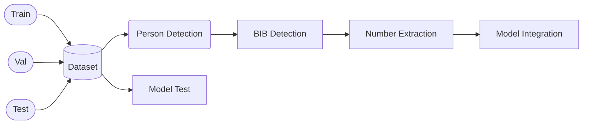

# BIB-Number-Extractor
This project is made for automated race results by identifying unique BIB number given to each participant which helps in player tracking and time calculations. This project contains Yolov11 architecture for the detection of bib number and Keras-OCR for extracting numbers.

## Dataset Description
The dataset used in this project comprises three subsets:
#### 1. Training Set:

  * Contains images and corresponding label files.
  * Label files provide bounding box coordinates and the single class ("BIB").
#### 2. Validation Set:

  * A smaller portion of the dataset for evaluating model performance during training.
#### 3. Test Set:

  * Contains unseen images used for testing the trained model.

### Label File Structure
Each label file follows the YOLO format:

* __Class ID__: 0 (for BIB numbers).
* __Bounding Box Coordinates__: [x_center, y_center, width, height] (normalized)

### Image Description
* Each image standard size should be __640 X 640__ px.

### Dataset Directory
> train
> > images
> > 
> > labels
> > 
> valid
> > images
> > 
> > labels
> > 
> test
> > images
> > 
> data.yaml

## Model Architecture
The project combines YOLOv11 for object detection task and Keras-OCR for optical character recognition.
1. __YOLOv11__:
    * Detects people visible in the image.
    * Detects bounding boxes around BIB numbers in the detected person region.
2. __Keras-OCR__:
    * Extracts text from the detected regions to recognize the actual BIB numbers.

## Installation and Setup
### Steps to clone the repository:
1. Clone the repository
```bash
git clone https://github.com/your-username/bib-number-extraction.git
```
2. Navigate to the project directory
```bash
cd bib-number-extraction
```
3. Install the required packages
```bash
pip install -r requirements.txt
```
## How to Use
1. Prepare Dataset:

  * Ensure your dataset is structured with images and label files in YOLO format.
  * Update paths in the configuration file if required.
Train YOLOv11 Model:

2. Run the training script to train the YOLOv11 model:
```bash
python BIB_paper_detect.py
```
3. Detect and Extract BIB Numbers:

  * Use the trained YOLOv11 model to validate BIB numbers:
```bash
python detect.py --images /path/to/valid/images --model /path/to/trained-model
```
4. Evaluate Results:

  * Test the complete pipeline on new images:
```bash
python evaluate.py --test-data /path/to/test/images
```
